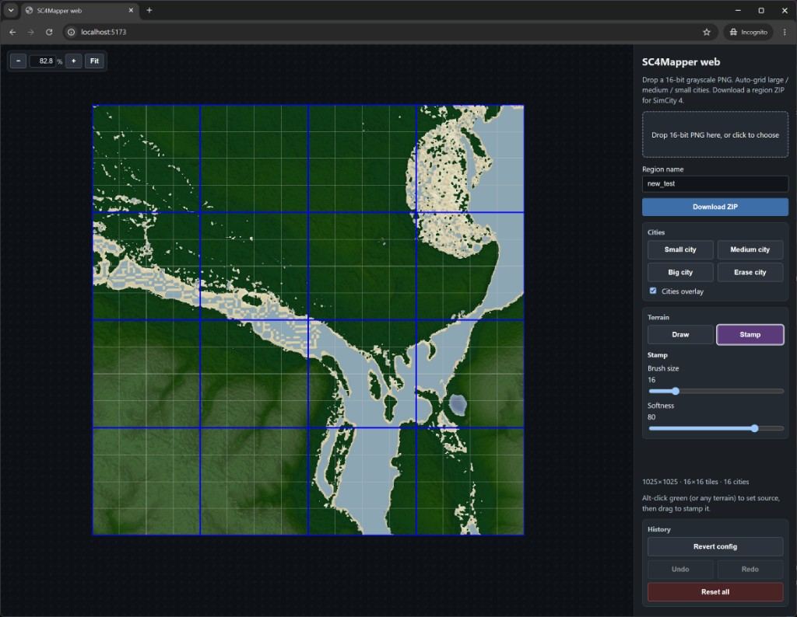

# sc4mapper-web



Browser tool for SimCity 4 region import: drop a **16-bit grayscale PNG**
heightmap, auto-build a city grid, download a ZIP of `.sc4` cities plus
`config.bmp`.

This repository is a TypeScript port of
[SC4Mapper-2026](https://github.com/caspervg/SC4Mapper-2026), which itself
modernizes the original
[SC4Mapper-2013](https://github.com/wouanagaine/SC4Mapper-2013)
by Wouanagaine and JoeST.

> This browser port was carried out primarily using Cursor AI agents,
> supervised and verified by a human maintainer.

## Features

### From SC4Mapper

- 16-bit grayscale PNG heightmap import (`tiles×64+1`, e.g. 1025×1025 → 16×16)
- Auto-grid large / medium / small cities (`BuildBestConfig`)
- Terrain colour palette and water line (mapper 250)
- QFS compression and DBPF `.sc4` city save
- Same blank city templates (`City - Small/Medium/Large.sc4`)
- Region ZIP with `config.bmp` for `Documents/SimCity 4/Regions/`

### New in the browser

- Runs in the browser — no desktop install
- **Draw** water, green, or a sampled colour onto the heightmap (soft brush)
- **Stamp** clone terrain (Alt-click a source, then paint it elsewhere)
- Place and erase small / medium / big cities on the config
- Undo / redo with Ctrl+Z and Ctrl+Shift+Z, revert city config, reset all
- Draft autosave in IndexedDB — reload and the unsaved map comes back
- Zoom and pan (wheel, Fit, Space-drag, Z-click)

## What Changed

- Ported the mapper import pipeline to TypeScript in the browser:
  QFS, DBPF city save, `BuildBestConfig` grid, and the terrain colour palette.
- Replaced the wxPython desktop UI with a Vite + canvas editor.
- Output is still a region ZIP for SimCity 4.
- No opening existing regions, SC4M, or 8-bit/RGB import.

## Run

```sh
npm install
npm run dev
```

Open the URL Vite prints.

PNG size must be `tiles×64+1` (example: 1025×1025 → 16×16).

## Build

```sh
npm run build
```

Static files go to `dist/`.

## Scope

In: 16-bit PNG → grid → region ZIP.

Out: open existing regions, SC4M, 8-bit/RGB import, desktop UI.

## License

See `LICENSE`. Source retains the original SC4Mapper-2013 copyright
(Wouanagaine, 2013). This is an unofficial fan tool, not affiliated with
EA or Maxis.
